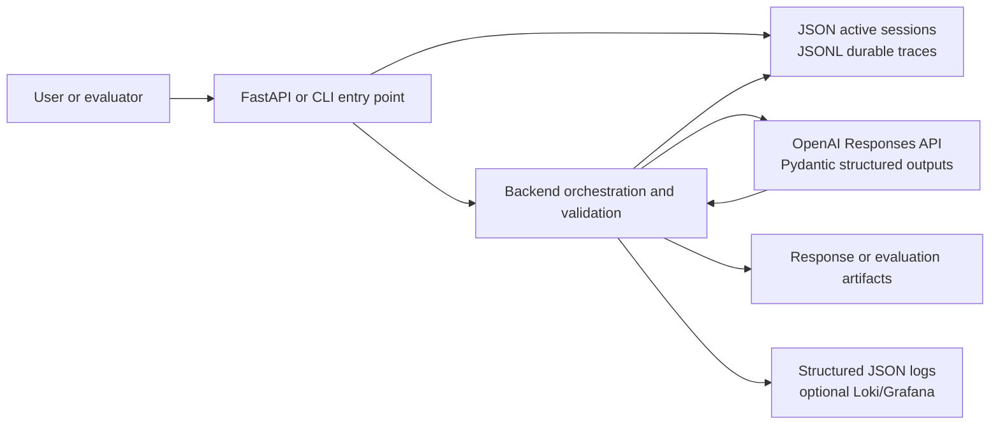
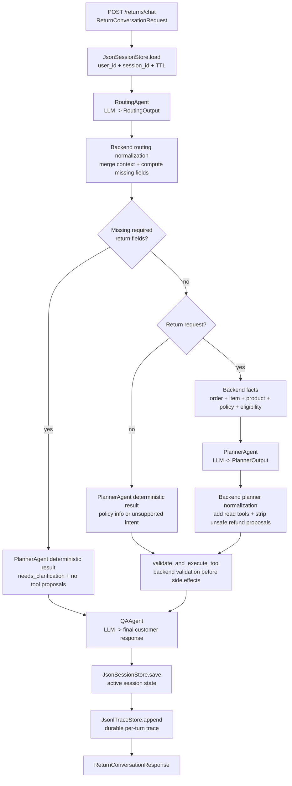
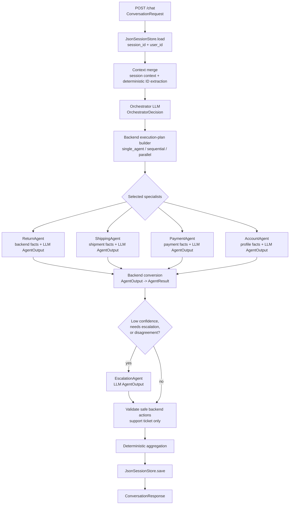
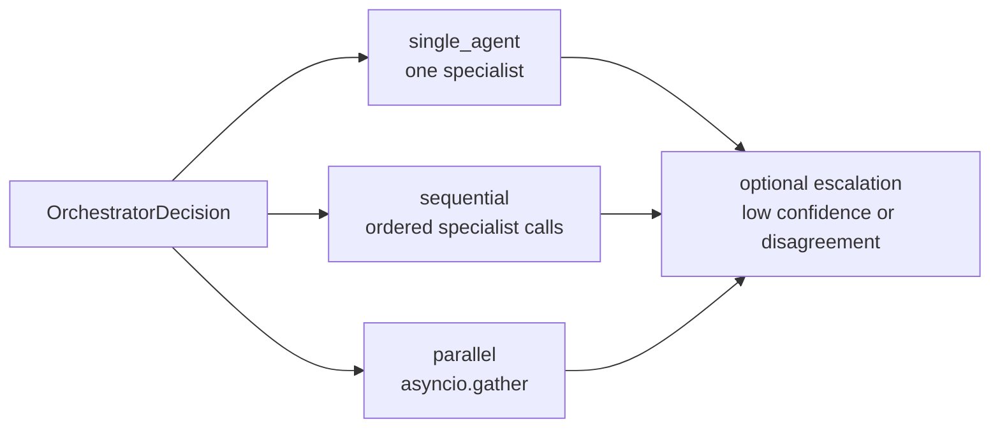
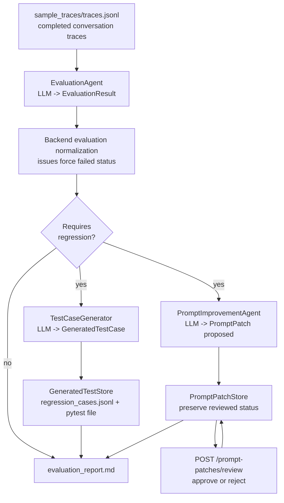
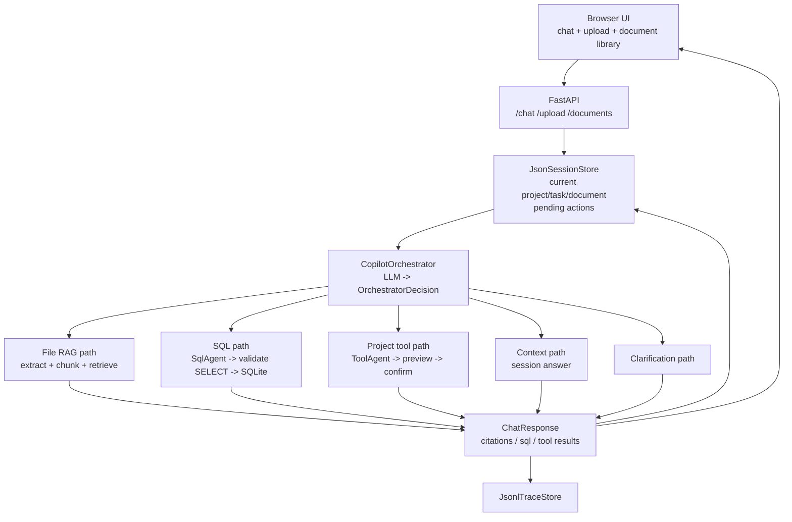
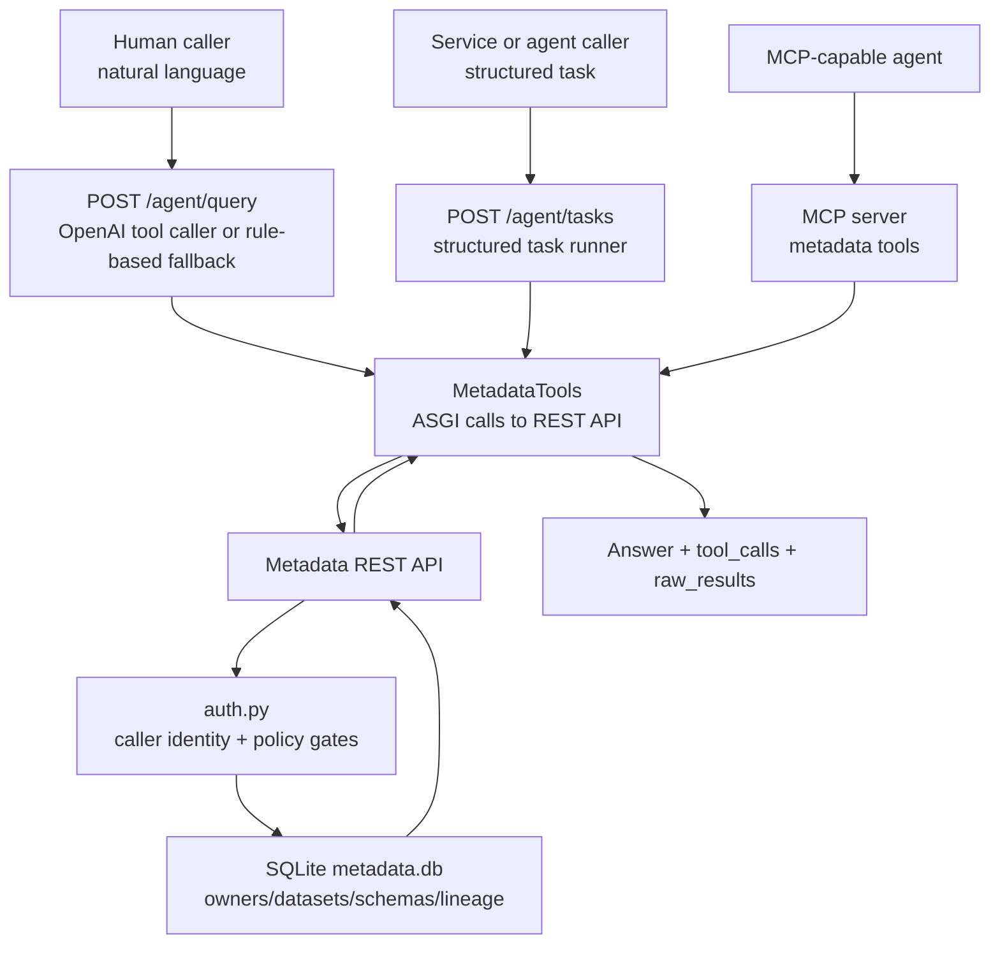
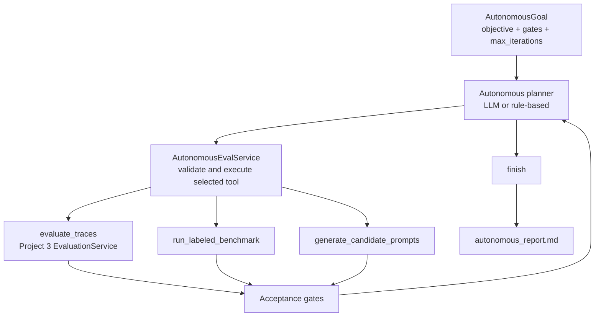
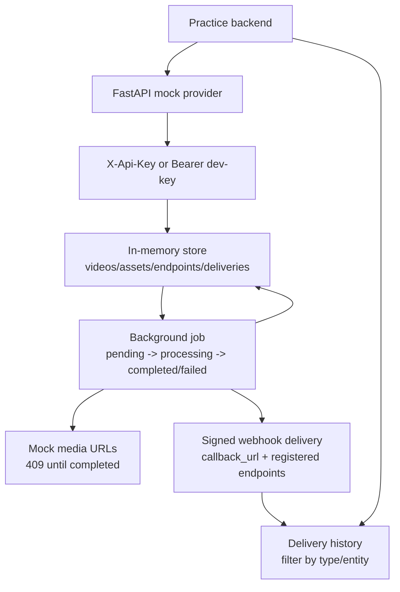

# Agentic System Architecture

This repo contains seven small backend and agentic-system prototypes. They share
the same runtime conventions but intentionally demonstrate different
architecture shapes:

1. **Project 1:** fixed multi-agent return pipeline
2. **Project 2:** orchestrator-led support routing
3. **Project 3:** out-of-band adaptive evaluation harness
4. **Project 4:** retrieval and tool-use project copilot
5. **Project 5:** agentic access layer over a metadata microservice
6. **Project 6:** bounded autonomous adaptive evaluation agent
7. **Project 7:** local mock video-generation provider

The implementations are deliberately small and interview-focused. The agents are
logical roles invoked per request, not long-running processes. Backend code owns
state, tool execution, validation, persistence, and side effects.

## Shared Runtime Pattern

The agentic projects use these common boundaries:

- **LLM boundary:** `OpenAILlmClient` calls the OpenAI Responses API with
  Pydantic structured outputs. Unit tests inject `RuleBasedLlmClient`.
- **State boundary:** request handlers load state or traces from local storage,
  run agent roles, then write updated state/artifacts back.
- **Tool boundary:** agents propose actions; backend code validates and executes
  only allowed side effects.
- **Safety boundary:** model output is treated as advisory until normalized or
  checked by deterministic code.
- **Observability boundary:** projects emit compact structured agent events to
  local JSON logs and can optionally push those events to Loki for Grafana
  inspection. Agent-facing observability access goes through a constrained
  read-only query tool, not arbitrary shell or Grafana admin APIs.
- **Adaptive-feedback boundary:** Project 3 can import Project 1 traces and
  session-scoped Loki context to propose prompt patches, but it does not apply
  those patches to Project 1 automatically. It also includes labeled evaluation
  cases and an approved-patch candidate prompt workflow so evaluator quality and
  prompt promotion are measurable before production prompt changes.
- **Autonomy boundary:** Project 6 lets an agent choose the next evaluation
  repair tool in a loop, but host code still executes tools, checks acceptance
  gates, bounds iterations, and prevents production prompt mutation.
- **External-provider boundary:** Project 7 is not an agentic workflow; it is a
  local provider mock that lets another backend practice async job creation,
  webhook verification, and media URL handling without a real external API.

The `.env` file is not auto-loaded. For local real-LLM runs:

```bash
set -a
source .env
set +a
```



## Project 1: Multi-Agent Return Bot

**Purpose:** demonstrate a fixed, returns-only agent workflow with routing,
planning, tool proposals, backend validation, and final customer messaging.

**Entry point:** `POST /returns/chat`

**Primary files:**

- `project1_multi_agent_return_bot/app/return_service.py`
- `project1_multi_agent_return_bot/app/return_agents.py`
- `project1_multi_agent_return_bot/app/tools.py`
- `project1_multi_agent_return_bot/app/policy.py`

### Architecture



The fixed pipeline always uses the same high-level stages. Clarification cases
skip the planner LLM call and tool execution because `PlannerAgent` returns a
deterministic `needs_clarification` result with no proposed tool calls.
Policy questions and unsupported intents can also produce deterministic planner
results before the planner LLM path.

Project 1 keeps active session state and durable traces separate. The prototype
uses JSON for active sessions with TTL metadata and JSONL for append-only
conversation traces. In production, the active store maps to Redis or another
low-latency session cache, while the trace store maps to a durable database or
analytics sink.

### Agent Roles

- **Routing Agent:** classifies the user intent and extracts `order_id`,
  `item_id`, return reason, refund request state, and product hint.
- **Planner Agent:** receives structured routing output and deterministic
  backend facts, then decides whether the request should be approved, rejected,
  clarified, or escalated.
- **Q&A Agent:** converts the planner decision and backend tool results into the
  final support response.

### Backend-Owned Decisions

The model does not have the final say on side effects. Backend code:

- merges session context with routing output
- computes missing required fields for return requests
- loads order, product, policy, and eligibility facts before planner execution
- adds required read-only tool proposals when missing
- removes `issue_refund` proposals when eligibility, ownership, or intent is not valid
- validates refund execution independently in `tools.py`

Refund validation checks:

- order exists
- authenticated user owns the order
- item belongs to the order
- refund amount matches order item data
- return policy allows the refund

### Tradeoffs

**Strengths**

- Predictable control flow: every return request follows the same pipeline.
- Easy to test: each step has a stable contract and fixed order.
- Strong safety boundary: backend validation sits between LLM proposals and writes.
- Good fit for narrow domains where nearly every request needs the same stages.

**Costs**

- Less flexible for mixed-domain support requests. Shipping or payment questions
  do not naturally belong in this fixed return pipeline.
- Can spend LLM calls on stages that are not needed for simple policy questions.
- Adding new domains tends to add branches inside the pipeline instead of a clean
  routing layer.
- Planner correctness depends on the quality of facts and normalization around
  the LLM output.

**Why this design here**

Project 1 is meant to teach the base vocabulary: agent, routing, planner,
handoff, tool proposal, backend validation, session state, and traceable final
response. A fixed pipeline makes those concepts visible without introducing
orchestration complexity too early.

## Project 2: Agent Orchestrator

**Purpose:** demonstrate an orchestrator-led architecture where a central routing
decision selects one or more specialist agents and chooses execution mode.

**Entry point:** `POST /chat`

**Primary files:**

- `project2_agent_orchestrator/app/service.py`
- `project2_agent_orchestrator/app/models.py`
- `project2_agent_orchestrator/app/tools.py`

### Architecture



Parallel plans use `asyncio.gather` for independent selected specialists.
Sequential plans execute one specialist per step. In both cases, backend code
builds the final plan from the LLM-requested mode and project-specific safety
rules.



### Agent Roles

- **Orchestrator:** selects specialists and requests an execution mode.
- **Return Agent:** resolves order/item and checks return eligibility.
- **Shipping Agent:** loads shipment status and flags delayed/lost/missing cases.
- **Payment Agent:** checks duplicate charges and refund timeline facts.
- **Account Agent:** loads profile data and flags sensitive account changes.
- **Escalation Agent:** proposes support-ticket creation when human review is
  needed.

### Execution Modes

The LLM proposes an execution mode, but backend code builds the final plan:

- `single_agent`: one specialist is enough.
- `parallel`: independent domains can run concurrently through `asyncio.gather`.
- `sequential`: sensitive requests or shipping-dependent requests run in order.

The backend also converts invalid combinations. For example, if multiple agents
are selected with `single_agent`, the plan becomes sequential.

### Backend-Owned Decisions

Project 2 gives the LLM more routing authority than Project 1, but the backend
still controls execution:

- specialist agent instances are selected from a fixed map
- backend tools load facts before specialist LLM calls
- specialist LLMs return `AgentOutput`, then backend wraps it as `AgentResult`
- unsafe actions stay proposed and are not executed automatically
- only non-approval support-ticket actions can be auto-executed
- disagreement or low confidence adds escalation

### Tradeoffs

**Strengths**

- Handles multi-domain requests without hardcoding every combination.
- Can run independent specialists in parallel.
- Domain agents stay smaller and easier to reason about.
- The final response can combine results from payment, return, shipping, account,
  and escalation paths.

**Costs**

- More moving parts than Project 1: routing, planning, specialist execution,
  escalation, aggregation, and action execution are separate concerns.
- LLM routing mistakes can select the wrong specialists; backend normalization
  reduces but does not eliminate that risk.
- Parallel execution makes shared context updates harder, so this prototype runs
  specialists against the same merged context and aggregates afterward.
- The final aggregator is deterministic string assembly, not a dedicated LLM
  synthesis agent. This is safer and predictable, but less polished for complex
  multi-agent answers.

**Why this design here**

Project 2 contrasts with Project 1. It shows when a central orchestrator is more
appropriate than a fixed pipeline: requests can span independent support domains,
and the system needs to choose which specialists run for each turn.

## Project 3: Adaptive Evaluation System

**Purpose:** demonstrate out-of-band evaluation and improvement for agentic
workflows without letting production agents rewrite themselves.

**Entry points:**

- `POST /evaluations/run`
- `POST /prompt-patches/review`
- CLI: `python3 -m project3_adaptive_eval_system.app.cli evaluate`

**Primary files:**

- `project3_adaptive_eval_system/app/service.py`
- `project3_adaptive_eval_system/app/agents.py`
- `project3_adaptive_eval_system/app/store.py`
- `project3_adaptive_eval_system/sample_traces/traces.jsonl`
- `project3_adaptive_eval_system/generated_tests/`

### Architecture



Project 3 runs outside the production request path. It reviews completed traces,
creates artifacts, and records patch review status; it does not apply prompt
changes to Projects 1 or 2.

### Agent Roles

- **Evaluation Agent:** scores completed traces across intent understanding,
  policy correctness, tool safety, response helpfulness, escalation correctness,
  latency awareness, and context preservation.
- **Test Case Generator:** converts failed traces into regression cases with
  expected behavior and assertions.
- **Prompt Improvement Agent:** proposes prompt patches that target the detected
  failure.

### Durable Artifacts

Project 3 writes artifacts to the repo so the evaluation loop is inspectable:

- `sample_traces/traces.jsonl`: sample good and bad traces
- `generated_tests/regression_cases.jsonl`: generated regression cases
- `generated_tests/test_generated_regressions.py`: executable regression checks
- `prompt_patches.jsonl`: proposed/reviewed prompt patches
- `evaluation_report.md`: Markdown report from the latest evaluation run

The generated pytest currently replays two Project 1 behaviors grounded in the
sample failures:

- delivery-date-based return policy behavior
- ownership validation blocking unsafe refund execution

### Backend-Owned Decisions

Project 3 is intentionally not an auto-tuning system:

- prompt patches are stored with `status="proposed"`
- patch approval or rejection only happens through the review endpoint
- approved/rejected status is preserved if evaluation regenerates the same patch
- evaluation normalization prevents contradictory LLM output from suppressing
  regression generation when issues are present
- generated tests are artifacts for future verification, not production changes

### Tradeoffs

**Strengths**

- Keeps improvement out of the production request path.
- Converts observed failures into durable regression artifacts.
- Makes prompt changes reviewable instead of automatic.
- Can evaluate Projects 1 and 2 traces without coupling evaluation code into
  their runtime services.

**Costs**

- It depends on trace quality. Missing tool results, policy facts, or expected
  behavior will reduce evaluation quality.
- It adds a second system to maintain: schemas, generated artifacts, reports, and
  review state.
- Generated tests are only as strong as the replay logic written for known
  failure classes. New failure categories may need new replay helpers.
- Prompt patches are suggestions, not guarantees. Human review and follow-up
  implementation are still required.

**Why this design here**

Project 3 demonstrates adaptive system design without uncontrolled self-learning.
The feedback loop can identify failures and propose improvements, but production
behavior changes only after human approval and code/prompt updates outside the
evaluation run.

## Project 4: Agentic Project Copilot

**Purpose:** demonstrate a retrieval and tool-use copilot that can work across
uploaded files, local structured task data, project API tools, session context,
and clarification.

**Entry points:**

- `GET /`
- `POST /chat`
- `POST /upload`
- `GET /documents`
- `POST /documents/{document_id}/select`
- `DELETE /documents/{document_id}`

**Primary files:**

- `project4_agentic_project_copilot/app/service.py`
- `project4_agentic_project_copilot/app/agents.py`
- `project4_agentic_project_copilot/app/document_store.py`
- `project4_agentic_project_copilot/app/sql_safety.py`
- `project4_agentic_project_copilot/app/tools.py`

### Architecture

The main pattern is:

```text
Copilot Orchestrator -> files/RAG | SQL/data | API tool | context | clarification
```

RAG is one capability path, not the whole system. The copilot also inspects a
local SQLite schema, generates read-only SQL, validates it before execution, and
requires confirmation before state-changing project API tools run.



The file RAG path persists uploaded document metadata, extracted chunks, and
JSON embeddings in local SQLite. The UI document library can list, select, and
delete stored documents. SQLite triggers write `document_index_events`, and the
app processes pending events to refresh only changed chunk embeddings. Retrieval
still scans local SQLite JSON embeddings, which keeps the MVP inspectable.

### Backend-Owned Decisions

- direct file follow-ups can preflight to the current document before the LLM
  orchestrator runs
- file answers must cite retrieved chunks
- generated SQL must be read-only `SELECT` or CTE SQL before SQLite execution
- state-changing project API tools create pending actions first
- confirmation is required before `create_task`, `update_task_status`,
  `assign_task`, or `add_comment` executes
- document deletion clears selected-session document context when needed

See `project4_agentic_project_copilot/docs/architecture.md` for the detailed
architecture, and `docs/project4_rag_pipeline.md` for the end-to-end RAG
pipeline.

## Project 5: Agentic Metadata Access Layer

**Purpose:** demonstrate how to add an agentic access layer beside an existing
deterministic metadata microservice without making the agent the source of
truth.

**Entry points:**

- REST metadata API: `GET /datasets`, `GET /datasets/search`,
  `GET /datasets/{dataset_id}`, `GET /datasets/{dataset_id}/schema`,
  `GET /datasets/{dataset_id}/lineage`
- REST writes: `POST /datasets`, `PATCH /datasets/{dataset_id}`,
  `DELETE /datasets/{dataset_id}`
- Agent layer: `POST /agent/query`, `POST /agent/tasks`
- MCP adapter: `python3 -m project5_agentic_metadata_demo.app.mcp_server`

**Primary files:**

- `project5_agentic_metadata_demo/app/metadata_service.py`
- `project5_agentic_metadata_demo/app/agent_service.py`
- `project5_agentic_metadata_demo/app/tools.py`
- `project5_agentic_metadata_demo/app/auth.py`
- `project5_agentic_metadata_demo/app/mcp_server.py`

### Architecture



The important boundary is that every path reaches the same metadata REST API.
The agent layer chooses tools, but `auth.py` and the deterministic service own
authorization, validation, and writes. The agent never receives raw SQLite
access.

### Backend-Owned Decisions

- every request carries `X-User`, `X-Team`, and `X-Role`
- viewer/editor/admin/service permissions are checked by deterministic policy
- cross-team or high-sensitivity reads are filtered or denied by the service
- editor writes are constrained to non-sensitive metadata for the caller's team
- deletes require admin/service role plus `X-Confirm-Dangerous-Action: true`
- agent responses expose `tool_calls` and `raw_results` for inspectability

## Project 6: Autonomous Evaluation Agent

**Purpose:** demonstrate a bounded autonomous loop over Project 3 evaluation
repair artifacts without giving the model permission to edit production prompts.

**Entry points:**

- `POST /autonomous-runs`
- CLI: `python3 -m project6_autonomous_eval_agent.app.cli run`

**Primary files:**

- `project6_autonomous_eval_agent/app/service.py`
- `project6_autonomous_eval_agent/app/agents.py`
- `project6_autonomous_eval_agent/app/tools.py`
- `project6_autonomous_eval_agent/app/models.py`

### Architecture



Project 6 changes Project 3 from a fixed workflow into an agent loop. The
planner observes prior tool results and gate status, then selects one allowed
tool. Host code executes the tool, writes artifacts under a per-run directory,
logs the step, and checks whether acceptance gates pass.

### Backend-Owned Decisions

- the planner can choose only `evaluate_traces`, `run_labeled_benchmark`,
  `generate_candidate_prompts`, or `finish`
- `max_iterations` is bounded by the request schema
- completion requires generated tests, prompt patches, benchmark quality, and
  candidate prompts when configured
- candidate prompts are written under `autonomous_runs/{run_id}/`, not to
  production prompt files
- a premature `finish` becomes `blocked`

## Project 7: Video Provider Mock Service

**Purpose:** provide local external-provider infrastructure for backend practice:
async video job creation, polling, asset upload, signed webhooks, and mock media
URLs without a real provider account.

**Entry points:**

- `POST /v1/video-generations`
- `GET /v1/video-generations/{session_id}`
- `GET /v1/videos/{video_id}`
- `POST /v1/assets`
- `GET /mock-assets/{asset_id}`
- `GET /mock-files/{video_id}.mp4`
- `GET /mock-files/{video_id}.jpg`
- `POST /v1/webhooks/endpoints`
- `GET /v1/webhooks/endpoints`
- `PATCH /v1/webhooks/endpoints/{endpoint_id}`
- `DELETE /v1/webhooks/endpoints/{endpoint_id}`
- `POST /v1/webhooks/endpoints/{endpoint_id}/rotate-secret`
- `GET /v1/webhooks/events`

**Primary files:**

- `project7_video_provider_mock/app/mock_video_provider.py`
- `project7_video_provider_mock/tests/test_mock_video_provider.py`

### Architecture



Project 7 is intentionally not an agentic workflow. It exists so another app can
practice integrating with provider-shaped APIs while still running everything on
localhost.

### Backend-Owned Decisions

- protected endpoints accept `X-Api-Key` or `Authorization: Bearer`
- job state is process-local and resets on server restart
- `mock_outcome`, `mock_delay_seconds`, and `mock:fail` prompts control local
  success/failure behavior
- one-off callbacks use `MOCK_VIDEO_PROVIDER_WEBHOOK_SECRET`
- registered webhook endpoints get their own `whsec_...` secret, returned only
  on create/rotate responses
- webhook events are signed with HMAC-SHA256 and recorded for debugging
- mock media endpoints return `409 resource_not_ready` before completion

## Comparison

| Dimension | Project 1 | Project 2 | Project 3 | Project 4 | Project 5 | Project 6 | Project 7 |
|---|---|---|---|---|---|---|---|
| Runtime shape | Fixed pipeline | Dynamic orchestration | Out-of-band evaluation | Orchestrated RAG + SQL + tools | Metadata API + optional NL/tool layer | Bounded autonomous eval loop | Local external-provider mock |
| Primary decision maker | Backend pipeline + role agents | Orchestrator + backend planner | Evaluation harness | Copilot orchestrator | Metadata service policy checks | Host loop gates + repair agent | Deterministic mock provider state machine |
| Main structured outputs | `RoutingOutput`, `PlannerOutput`, `QAOutput` | `OrchestratorDecision`, `AgentOutput` | `EvaluationResult`, `GeneratedTestCase`, `PromptPatch` | `OrchestratorDecision`, `SqlPlan`, `ToolCall`, `FileAnswer` | `DatasetRead`, `AgentTaskResponse`, metadata tool calls | `AutonomousAction`, `AcceptanceGate`, `AutonomousRunResult` | Video, asset, webhook, and delivery JSON envelopes |
| Side effects | Refunds after validation | Support tickets only when safe | File artifacts and patch review status | Confirmed task API writes | Metadata CRUD only after auth checks | Generated tests, reports, prompt-patch files | Async job state, mock media, signed webhook calls |
| Best fit | Narrow workflow | Multi-domain support | Continuous improvement loop | Knowledge/data/tool copilot | Governed metadata access | Autonomous repair practice with hard bounds | Backend integration practice without real provider cost |
| Main risk | Rigid branching | Routing/aggregation complexity | Weak traces or weak generated tests | Retrieval quality, SQL safety, write confirmation UX | Authorization drift or vague NL plans | Over-broad autonomous edits without gates | Treating a local mock as internet-safe infrastructure |

## Design Rules Used Across Projects

1. Keep agents stateless and invoke them per request or per evaluation run.
2. Store state outside agent roles.
3. Use structured outputs for model responses.
4. Pass backend facts into agents instead of asking agents to invent facts.
5. Validate every proposed side effect in deterministic code.
6. Normalize model output when safety or consistency requires it.
7. Keep tests deterministic by injecting rule-based LLM clients.
8. Exercise real LLM calls separately with `.env` sourced.
9. Keep adapters narrow: project tools, MCP tools, log tools, and provider mocks
   should expose only the operations needed for the exercise.
