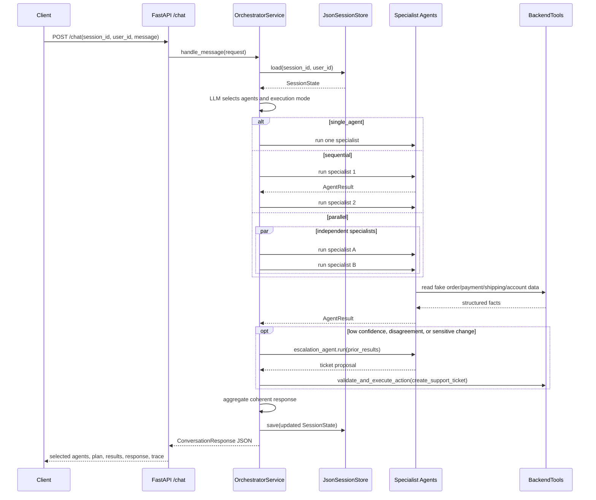

# Architecture

## Core Flow

The orchestrator is implemented in `app/service.py`. It loads session state,
routes the message through an OpenAI-backed structured-output client, builds an
execution plan, runs specialist agents, optionally adds escalation, validates
backend actions, aggregates the final answer, and saves session state.

Domain agents are stateless. They receive `message`, `user_id`, and the loaded
session context, fetch backend facts, then ask the LLM to return a Pydantic
`AgentResult`. Tests inject `RuleBasedLlmClient` for deterministic offline
coverage; production services default to `OpenAILlmClient`, which calls the
OpenAI Responses API.

## Sequence Diagram



## Example Traces

### Single Agent

Request:

```text
Where is package order-1004?
```

Trace:

```json
{
  "selected_agents": ["shipping_agent"],
  "execution_plan": {"mode": "single_agent"},
  "agent_results": ["shipping_agent: shipment_delayed"],
  "final_response": "Order order-1004 is delayed with FedEx..."
}
```

### Multi-Agent Parallel

Request:

```text
I was charged twice and I also want to return the shoes.
```

Trace:

```json
{
  "selected_agents": ["return_agent", "payment_agent"],
  "execution_plan": {"mode": "parallel"},
  "agent_results": ["return_agent: return_eligible", "payment_agent: duplicate_charge_found"],
  "final_response": "City Runner Shoes is eligible for return... I found a likely duplicate charge..."
}
```

### Multi-Agent Sequential

Request:

```text
My package order-1004 is delayed and I want a refund status update.
```

Trace:

```json
{
  "selected_agents": ["shipping_agent", "payment_agent"],
  "execution_plan": {"mode": "sequential"},
  "agent_results": [
    "shipping_agent: shipment_delayed",
    "payment_agent: refund_timeline",
    "escalation_agent: human_ticket_recommended"
  ],
  "final_response": "Order order-1004 is delayed... I created support ticket ..."
}
```

## Safety Boundary

Specialist agents do not execute irreversible changes. They return structured
proposals. The orchestrator/backend layer decides whether a proposed action is
allowed. Unsafe payment actions remain pending for approval.

## Session Isolation

`JsonSessionStore` keys state by `session_id`, and each request also includes
`user_id`. Agents do not retain in-memory user state; context is loaded at the
start of a request and saved at the end.
