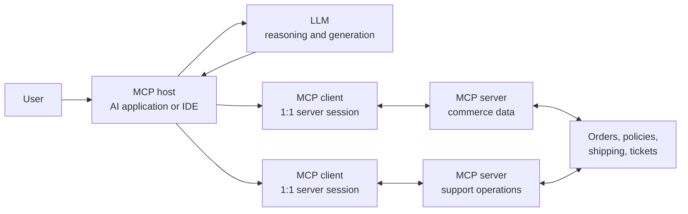
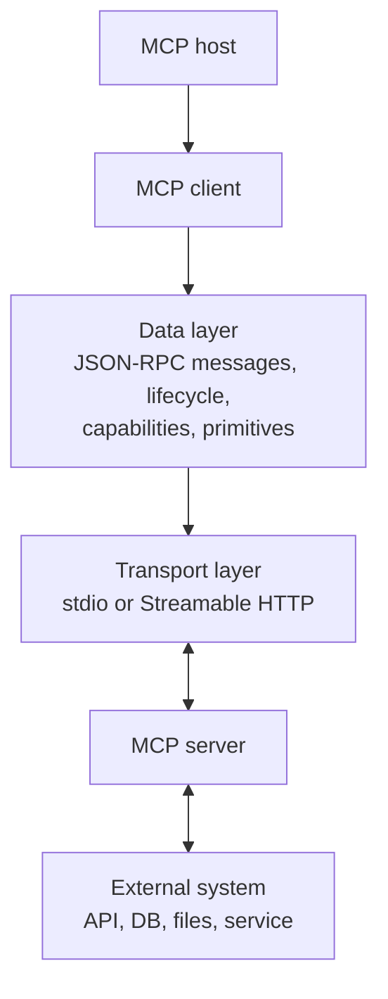
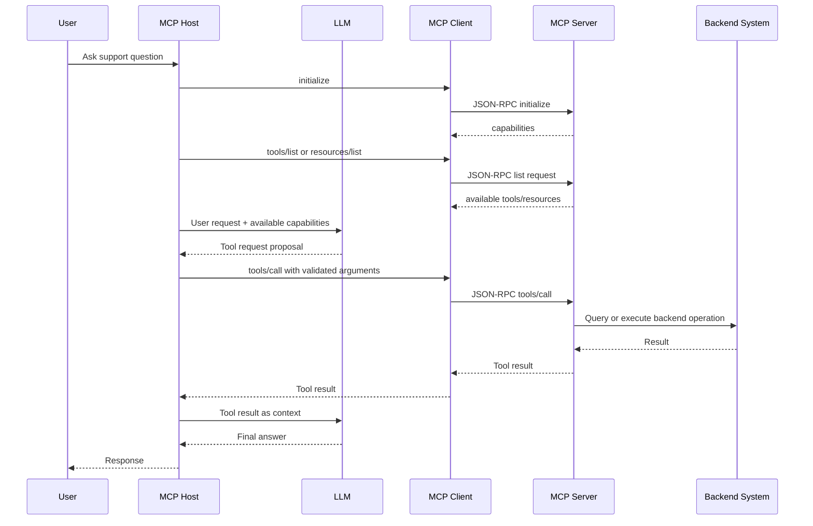
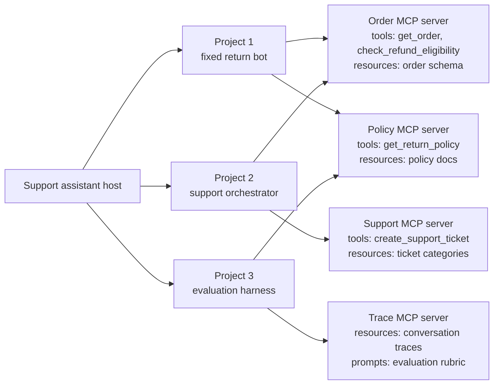

# MCP Architecture

This note explains the Model Context Protocol (MCP) architecture and why it is
useful for agentic systems. It is a conceptual reference for this repo; Projects
1-3 do not currently implement an MCP server or client.

Sources:

- Official architecture overview: <https://modelcontextprotocol.io/docs/learn/architecture>
- Draft architecture specification: <https://modelcontextprotocol.io/specification/draft/architecture/>

## What MCP Defines

MCP defines a standard protocol for moving context and tool access between an AI
application and external systems. It focuses on context exchange. It does not
decide which LLM to use, how prompts are written, how the host application
manages memory, or how a production backend validates side effects.

The useful mental model is:

```text
User asks for help.
AI application decides it needs external context or an action.
MCP client talks to an MCP server using a standard protocol.
MCP server exposes tools, resources, or prompts.
AI application feeds the result back into the model or backend workflow.
```

## Core Participants



### User

The user asks for help through the host application. The user does not usually
talk directly to an MCP server.

### MCP Host

The host is the AI application. Examples include an agentic coding tool, an IDE,
or a support assistant. The host coordinates model calls, decides which connected
servers are available, manages user consent and security policy, and creates one
MCP client per server connection.

### LLM

The LLM reasons over the user request and available context. In a typical host,
the model can choose to use available tools, but the host is responsible for
routing those tool calls through MCP clients and handling the results. MCP does
not replace the LLM or define the model prompt.

### MCP Client

An MCP client is a host-managed component that maintains a dedicated connection
to one MCP server. If the host connects to three MCP servers, the host has three
client sessions. This 1:1 client-server boundary matters because each server can
have different capabilities, permissions, lifecycle, and trust level.

### MCP Server

An MCP server is a program that exposes context and capabilities. It can run
locally, such as a filesystem server launched over stdio, or remotely, such as a
service reached over Streamable HTTP. Servers expose primitives such as tools,
resources, and prompts.

## Protocol Layers



MCP separates the protocol data layer from the transport layer:

- **Data layer:** JSON-RPC-based messages, request/response correlation,
  lifecycle management, capability negotiation, notifications, and primitives.
- **Transport layer:** the communication channel. Current official docs describe
  stdio for local process communication and Streamable HTTP for remote servers.

This separation lets the same logical operation, such as `tools/list` or
`tools/call`, work across local and remote servers.

## Primitives

MCP servers can expose three core server-side primitives:

- **Tools:** executable functions the host can invoke, such as querying an order
  service or creating a support ticket.
- **Resources:** contextual data the host can read, such as a policy document,
  schema, file content, or customer-support knowledge base entry.
- **Prompts:** reusable prompt templates or interaction patterns supplied by the
  server.

MCP also supports client-side primitives. For example, a server can request
sampling from the host LLM or elicit additional information from the user, if the
client and host support those capabilities.

## Typical Request Flow



The exact host policy can vary. A careful host should still validate sensitive
tool requests, ask the user for approval when needed, and enforce authorization.
MCP standardizes the communication path; it does not remove application-level
safety responsibilities.

## Careful Example: E-Commerce Support Assistant

Imagine this repo is extended with MCP around the existing projects.

Without MCP, every host or agent runtime needs custom integration code for each
backend:

```text
Return bot -> custom order API client
Return bot -> custom policy API client
Orchestrator -> custom shipping API client
Orchestrator -> custom payment API client
Evaluation harness -> custom trace store reader
```

That works for a small prototype, but the integration surface grows quickly. Each
new host has to learn each backend's authentication, schemas, discovery, error
format, and tool-calling conventions.

With MCP, the backend capabilities can be grouped behind focused servers:



A customer asks:

> I received order `ORDER-1001` yesterday, the shoes are too small, and I want a
> refund. If not, please open a support ticket.

A careful MCP-backed flow could be:

1. The host loads connected MCP server capabilities through `tools/list` and
   `resources/list`.
2. The return workflow identifies that it needs order facts and policy facts.
3. The host calls the Order MCP server's `get_order` tool with `ORDER-1001`.
4. The host calls the Policy MCP server's `get_return_policy` tool for the item
   category returned by the order data.
5. The planner receives facts from MCP tool results, not invented policy text.
6. If the model proposes a refund, backend validation still checks ownership,
   item match, amount, and policy eligibility before any write.
7. If the refund is not allowed or confidence is low, the host calls the Support
   MCP server's `create_support_ticket` tool, if the action is permitted.
8. Project 3 can later read conversation traces through a Trace MCP resource and
   generate regression tests from failures.

The important part is not that MCP magically makes the agent correct. The
important part is that the host can discover and call external capabilities
through a consistent protocol while keeping validation and consent in the host
and backend.

## Why MCP Is Useful

### Standardized Discovery

The host can ask each server what it exposes instead of hardcoding every
available tool at build time. Dynamic discovery is especially useful when
available tools depend on environment, account permissions, or server version.

### Clear Security Boundaries

Each MCP client has a dedicated connection to one server. That makes it easier to
reason about which external system supplied which capability, which credentials
were used, and which operations should require user approval.

### Smaller Integration Surface

Instead of every AI application writing custom clients for every backend, backend
teams can expose focused MCP servers. Hosts integrate once with MCP and then
connect to many servers through the same protocol shape.

### Better Agent Portability

An agent workflow can move between host applications more easily when its tools
and resources are exposed through MCP. The workflow still needs host-specific
policy, but the external capability contract is less bespoke.

### Runtime Adaptability

Because servers can report tool-list changes, a host can refresh capabilities
without polling or redeploying. This is useful for long-running IDE or support
assistant sessions where permissions and available operations can change.

## Tradeoffs And Responsibilities

MCP does not eliminate backend engineering. It adds a protocol boundary that must
be designed carefully.

- **Authorization still matters:** the server and backing service must enforce
  user identity, tenant boundaries, and operation permissions.
- **Tool results are context, not truth by default:** the host should preserve
  provenance and handle stale or partial results.
- **Sensitive writes need policy:** refunds, payments, account changes, and data
  deletion should still require deterministic validation and, when appropriate,
  user confirmation.
- **Server descriptions influence the model:** misleading tool names,
  descriptions, or schemas can cause poor tool selection.
- **More components mean more operations work:** hosts, clients, servers,
  transports, credentials, logging, and version compatibility all need ownership.

## Relation To This Repo

This repo currently implements direct in-process fake tools and local JSON/JSONL
stores. That is intentional for a small interview-focused lab.

MCP would become useful if the projects needed to share backend capabilities
across multiple hosts or agent runtimes. A reasonable next iteration would be:

1. Keep Project 1 and Project 2 backend validation unchanged.
2. Wrap read-only order and policy capabilities in an MCP server.
3. Expose support-ticket creation as a separate server with explicit approval
   policy.
4. Let Project 3 consume traces through a resource-oriented MCP server.
5. Keep refunds behind deterministic backend validation rather than treating
   model-selected MCP tools as automatically safe.

