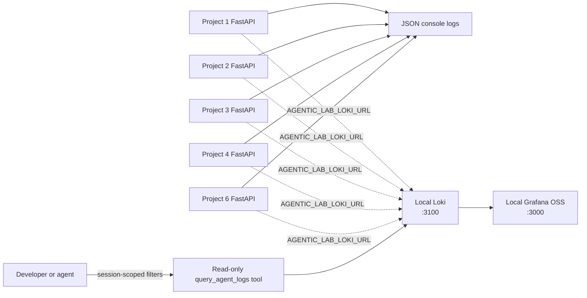

# Local Observability and Grafana Tooling

This repo now has a small local observability layer for Projects 1-4 and
Project 6. It is designed for agentic-system debugging, not production
monitoring completeness.

## Architecture



Each app configures shared JSON logging through
`agentic_system_lab.observability.configure_observability_logging`.

By default, logs still go to local stdout/stderr. If `AGENTIC_LAB_LOKI_URL` or
`LOKI_URL` is set, only records emitted through `log_agent_event` are pushed to
Loki. Ordinary Python logs stay local so accidental prompt or payload logging is
not forwarded to the observability store.

## What Gets Logged

The shared helper emits compact structured events for system-level inspection:

- `user_message`: request received, with message length only.
- `agent_decision`: routing, planning, orchestration, evaluation, and specialist
  decisions.
- `tool_execution`: backend tool validation/execution results.
- `document_ingested` / `document_deleted`: Project 4 RAG document lifecycle.
- `autonomous_run_started` / `autonomous_run_finished`: Project 6 run lifecycle.
- `final_response`: final response metadata.

The logs intentionally avoid storing raw prompts, uploaded document text, API
keys, or full model payloads. Sensitive keys such as `api_key`, `token`,
`authorization`, `password`, and `secret` are redacted before logging.

## Run Locally

Start Grafana OSS and Loki. The Compose file binds both services to
`127.0.0.1` so the unauthenticated Loki API is not exposed on your LAN:

```bash
cd observability
docker compose up
```

If your Docker install uses the legacy Compose binary:

```bash
cd observability
docker-compose up
```

Grafana is available locally at:

```text
http://localhost:3000
```

The local credentials are:

```text
username: admin
password: admin
```

Loki is available locally at:

```text
http://localhost:3100
```

In another shell, run one project with Loki forwarding enabled:

```bash
export AGENTIC_LAB_LOKI_URL=http://localhost:3100
uvicorn project1_multi_agent_return_bot.app.main:app --reload --port 8001
```

Then send traffic to the project and inspect logs in Grafana Explore using the
pre-provisioned `Agentic Lab Loki` data source.

Example LogQL selector:

```text
{project="project1"}
```

Example filtered selector:

```text
{project="project1"} |= "planner_agent" |= "agent_decision"
```

## Safe Agent Tool

The agent-facing tool is
`agentic_system_lab.observability.LokiLogQueryTool`.

It is intentionally narrower than raw `curl`:

- It only performs `GET /loki/api/v1/query_range`.
- It only accepts allowlisted project labels.
- Agent-facing queries require `session_id` by default.
- It builds LogQL from exact JSON field filters instead of accepting raw LogQL
  or broad line-contains searches.
- It bounds the time window and result limit.
- It cannot create dashboards, modify data sources, delete logs, or call admin
  Grafana APIs.

Example CLI usage:

```bash
python -m agentic_system_lab.observability.cli \
  --project project1 \
  --session-id session-123 \
  --agent planner_agent \
  --event agent_decision \
  --since-minutes 30 \
  --limit 50
```

Equivalent function-tool shape:

```json
{
  "name": "query_agent_logs",
  "arguments": {
    "project": "project1",
    "session_id": "session-123",
    "agent": "planner_agent",
    "event": "agent_decision",
    "since_minutes": 30,
    "limit": 50
  }
}
```

For local developer investigations, the CLI has an explicit
`--allow-broad-query` flag. Do not expose that mode as an end-user or LLM tool.

## Why This Is Good Agentic-System Practice

Agents should not receive broad infrastructure credentials or arbitrary shell
access when a narrow tool can answer the operational question. This design keeps
the model behind a constrained read-only API:

- The backend owns the HTTP calls to Loki.
- The LLM chooses exact session-scoped filters, not arbitrary endpoints.
- The tool validates arguments before execution.
- The observability path is out-of-band from production actions.
- Failed Loki pushes do not break user requests.
- Loki forwarding is best-effort and non-blocking by default, with a short
  network timeout.

For local development, Grafana OSS and Loki run for free. Grafana Cloud Free can
also be used later, but this repo defaults to a self-contained local stack so the
projects remain reproducible without a cloud account.
