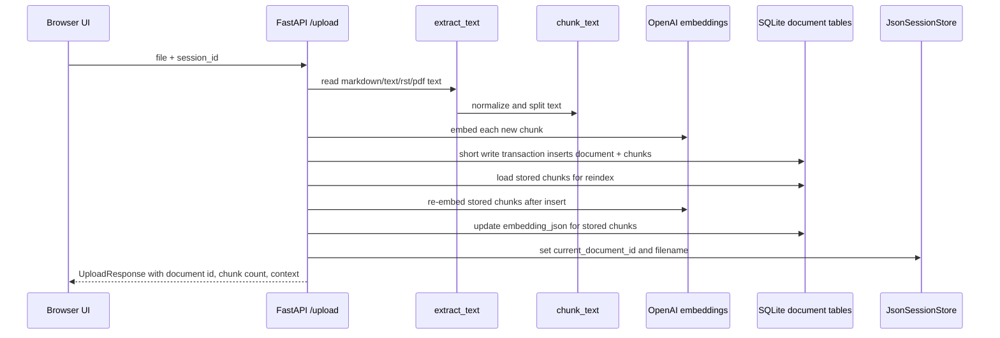
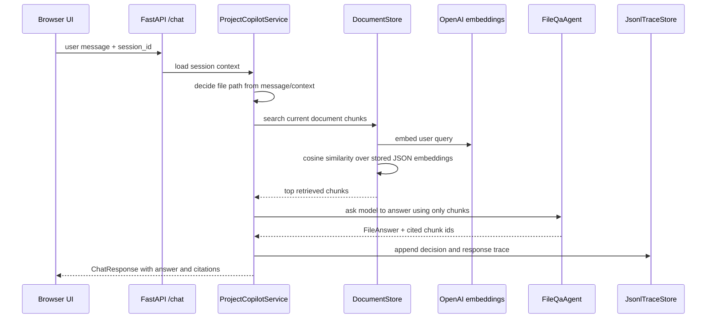

# Project 4 RAG Pipeline

Project 4 is an agentic project copilot with several capability paths:

- file RAG over uploaded documents
- read-only SQL over a local task database
- confirmed API tool calls for task actions
- session context and clarification

The RAG path is one branch of the larger copilot architecture. It is used when
the user asks about uploaded files or when the current conversation context
points to a selected document.

## What Gets Persisted

Uploaded files are persisted in local SQLite:

```text
project4_agentic_project_copilot/data/copilot.sqlite3
```

Project 4 stores document metadata and extracted chunks:

- `documents`: `document_id`, `filename`, `content_type`, `created_at`
- `document_chunks`: `chunk_id`, `document_id`, `chunk_index`, extracted
  `text`, and `embedding_json`

The raw original file bytes are not stored. The system stores extracted text
chunks and embeddings.

Session context is stored separately in JSON:

```text
project4_agentic_project_copilot/data/sessions.json
```

The active session tracks the current document:

```text
current_document_id
current_document_filename
```

This is why a follow-up like "what does this file say?" can resolve to the file
selected in that session without searching another user's current document.

## Upload And Index Flow

Upload entry point:

```text
POST /upload
```

The current implementation follows this flow:



Important details:

- Text files, markdown, reStructuredText, and PDFs are supported.
- PDF text extraction uses `pypdf`.
- Chunk embeddings are computed before the SQLite write transaction starts, so
  the database is not locked while waiting on external embedding calls.
- After insert, Project 4 recomputes embeddings for stored chunks. This is a
  deliberately simple full-reindex strategy for the MVP.

## Document Library Flow

The UI document library is backed by these endpoints:

```text
GET /documents
POST /documents/{document_id}/select
DELETE /documents/{document_id}?session_id=...
```

The library lets the user:

- view all stored documents
- select an existing document as the current session document
- delete a document

Selecting a document updates only session context. It does not recompute
embeddings because the stored document chunks did not change.

Deleting a document removes its chunks, clears the current session document if
that deleted document was selected, and reindexes remaining chunks.

## Retrieval And Answer Flow

Chat entry point:

```text
POST /chat
```

The file RAG path follows this flow:



The backend constrains retrieval to the current session document for file
questions. This avoids one session accidentally answering from a document that
another session uploaded.

The `FileQaAgent` is instructed to answer using only retrieved chunks. The
response includes citations built from retrieved chunk metadata:

```text
document_id
filename
chunk_id
chunk_index
score
quote
```

## Where The Orchestrator Fits

Project 4 is not a pure RAG app. The copilot can route a turn to:

- `file_retrieval`
- `sql_query`
- `api_tool`
- `context`
- `clarify`

For direct file questions with a selected current document, backend preflight
routes to the RAG path. For other requests, `CopilotOrchestrator` produces a
structured `OrchestratorDecision`.

This keeps RAG as a capability path inside an agentic orchestration layer rather
than making retrieval the only behavior.

## Why Reindex On Insert And Delete

The user-facing requirement is that stored document changes should keep the
vector store current. The MVP implements this by recomputing embeddings for all
stored chunks after document insert or delete.

Tradeoffs:

- **Simple and inspectable:** every stored chunk is refreshed from persisted
  chunk text.
- **Good for a small local demo:** no background worker or vector DB is needed.
- **Not production efficient:** full reindexing is O(number of chunks) and can
  get slow as documents grow.

In production, this would usually become incremental vector index updates plus a
background repair/reindex job.

## Safety And Limitations

The RAG path improves grounding but does not make the answer externally
verified. File answers mean "according to the uploaded document."

Current limitations:

- The vector store is SQLite rows with JSON embeddings, not a dedicated vector
  database.
- Retrieval uses a full scan with cosine similarity.
- The original uploaded file bytes are not retained.
- Full reindexing is intentionally simple and can be expensive for large corpora.
- Document access is session-context based in the prototype; there is no auth
  middleware.

These constraints keep the project small and easy to inspect while preserving
the real RAG architecture shape.
