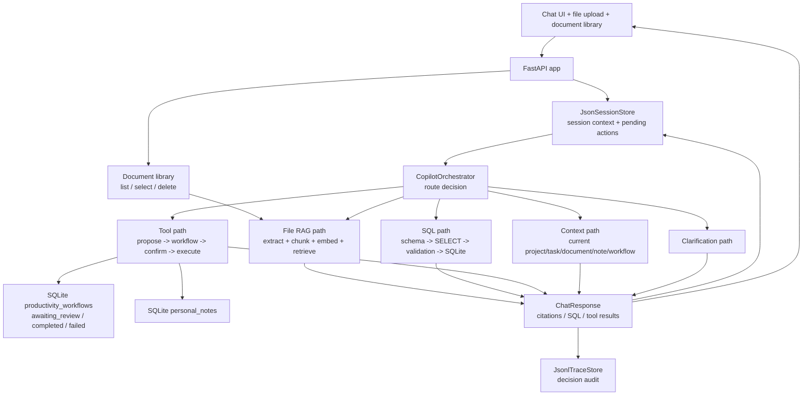

# Agentic Project Copilot Architecture

Project 4 is an orchestrated local-first productivity workflow prototype. It is
not just a RAG app: RAG is one capability path among uploaded files and notes,
SQL, productivity tools, persisted workflow state, session context, and
clarification.



## Storage

Project 4 keeps everything local for the MVP:

- SQLite task database for structured data.
- SQLite document tables for vector chunks.
- SQLite `personal_notes` for durable captured notes.
- SQLite `productivity_workflows` and `workflow_steps` for reviewable workflow
  state.
- JSON session file for current context and pending confirmations.
- JSONL trace file for orchestration decisions.

Uploaded documents are durable in SQLite. The UI document library reads the
`documents` and `document_chunks` tables to show all stored documents, allows a
user to select a stored document as the current session document, and can delete
a stored document.

File uploads are tied to the active chat session. The upload endpoint stores the
chunks in SQLite and records the uploaded `document_id` as
`SessionContext.current_document_id` and the uploaded filename as
`SessionContext.current_document_filename`. This lets follow-up requests such as
"what is this file doing?" resolve to the current document instead of relying on
global document search. The upload response also returns the updated session
context so the UI can display the selected document immediately and add a
chat-visible upload confirmation. If the previous turn asked for a file before
upload, short follow-ups such as "how about now" are treated as references to
the newly selected document.

Personal notes are created through the same tool boundary as project actions.
The model proposes `create_note`, the backend records a pending workflow with
`awaiting_review` status, and only an explicit confirmation writes the note row.
Read-only note search uses `search_notes` and can execute without confirmation.

When a current note or current document is converted into a follow-up task, the
pending `create_task` proposal is stored in `productivity_workflows` before any
task row is created. Confirmation executes the tool and appends a
`workflow_steps` record with the final result.

Embeddings are generated before the SQLite write transaction starts. The
transaction only inserts the document and chunks, which avoids holding a write
lock while waiting on external embedding calls.

Document chunk inserts, text updates, and deletes are captured in a local
`document_index_events` table through SQLite triggers. The app processes pending
events immediately after upload/delete for read-after-write freshness, while
keeping the event log durable enough for a later background worker. Insert and
text-update events refresh only affected chunk embeddings; delete events are
marked processed after the chunk is gone.

In production, the same logical split would map to:

- Postgres or another transactional DB for tasks, comments, notes, and
  workflow state.
- A vector store for document chunks.
- Redis or another session store for current context and pending actions.
- Durable trace storage for observability and evaluation.

## Tool Safety

The text-to-SQL path only permits read-only `SELECT` or CTE queries. The backend
rejects destructive/admin terms before SQLite execution.

The API tool path requires confirmation for every state-changing action:

- `create_task`
- `update_task_status`
- `assign_task`
- `add_comment`
- `create_note`

Only `search_tasks` and `search_notes` are read-only and can execute
immediately.

The live OpenAI structured-output schemas avoid unbounded object fields for
agent-produced tool arguments. This keeps function-like tool proposals explicit:
the model can fill known fields such as `project_id`, `task_id`, `status`,
`title`, `body`, `query`, `note_id`, or `source_document_id`, and backend
validators still make the final execution decision.

## Evaluation Harness

`project4_agentic_project_copilot.app.evaluation` now has two layers:

- JSONL regression cases for route selection, RAG, SQL safety, tool selection,
  review gates, note capture, and note-to-task conversion.
- `run_goal_harness()`, an end-to-end acceptance harness for the claim that
  Project 4 supports local-first AI productivity workflows for personal files
  and notes.

The goal harness checks uploaded-document RAG with citations, local persistence,
human review before note/task writes, durable workflow state before execution,
workflow completion after confirmation, and regression-suite health.

## Pattern

This project adds a new pattern to the repo:

```text
Local-first productivity workflow architecture
```

It still uses the Project 2 orchestrator idea, but routes by capability rather
than by customer-support domain.

For the end-to-end upload, persistence, retrieval, citation, document-library,
chunking benchmark, and freshness flow, see `../../docs/project4_rag_pipeline.md`
and `../../docs/project4_rag_chunking_freshness.md`.
