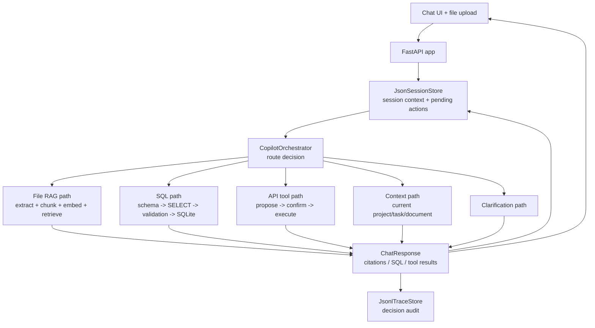

# Agentic Project Copilot Architecture

Project 4 is an orchestrated retrieval and tool-use copilot. It is not just a
RAG app: RAG is one capability path among files, SQL, project APIs, session
context, and clarification.



## Storage

Project 4 keeps everything local for the MVP:

- SQLite task database for structured data.
- SQLite document tables for vector chunks.
- JSON session file for current context and pending confirmations.
- JSONL trace file for orchestration decisions.

In production, the same logical split would map to:

- Postgres or another transactional DB for tasks and comments.
- A vector store for document chunks.
- Redis or another session store for current context and pending actions.
- Durable trace storage for observability and evaluation.

## Tool Safety

The text-to-SQL path only permits read-only `SELECT` or CTE queries. The backend
rejects destructive/admin terms before SQLite execution.

The API tool path requires confirmation for every state-changing action:

- `create_task`
- `update_task_status`
- `assign_task`
- `add_comment`

Only `search_tasks` is read-only and can execute immediately.

## Pattern

This project adds a new pattern to the repo:

```text
Retrieval and tool-use copilot architecture
```

It still uses the Project 2 orchestrator idea, but routes by capability rather
than by customer-support domain.
