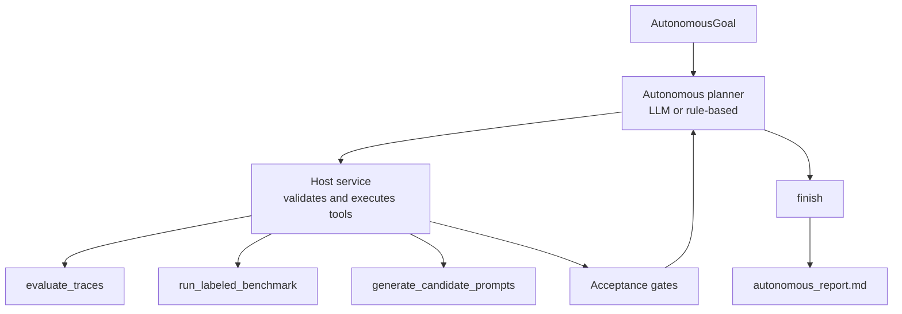

# Autonomous Evaluation Agent Architecture

Project 6 is a bounded autonomous agent system for adaptive evaluation. It builds
on Project 3, but changes the runtime shape from a fixed workflow into a host
controlled loop:

```text
goal -> planner chooses one tool -> host validates/executes -> observe gates -> repeat
```

The agent can plan evaluation repair steps, but it cannot mutate production
prompts or execute arbitrary tools.



## Entry Points

- API: `POST /autonomous-runs`
- CLI: `python3 -m project6_autonomous_eval_agent.app.cli run`
- Deterministic CLI: `python3 -m project6_autonomous_eval_agent.app.cli run --use-rule-based`

## Workflow Versus Agent

Project 3 is a workflow. It runs fixed evaluation steps and stops with proposed
artifacts.

Project 6 is an agent loop. The planner observes state, chooses the next tool,
receives the result, and continues until the host acceptance gates pass or the
iteration bound is reached.

## Tool Boundary

The autonomous planner can select only these tools:

- `evaluate_traces`
- `run_labeled_benchmark`
- `generate_candidate_prompts`
- `finish`

The host executes the tools. This preserves deterministic control over file
writes, benchmark thresholds, and completion status.

## Acceptance Gates

The host checks gates before each planner step and after the run:

- `evaluations_created`: trace evaluation produced generated tests and prompt
  patches.
- `benchmark_quality`: labeled benchmark pass/fail accuracy and issue-category
  recall meet the goal thresholds.
- `candidate_prompts`: candidate prompt files exist when required.
- `production_prompt_guard`: autonomous output remains review artifacts only.

If the planner selects `finish` before these gates pass, the run is marked
`blocked`. If the loop reaches `max_iterations` before satisfying the gates, the
run is marked `max_iterations_reached`.

## Run Artifacts

Each run writes to `project6_autonomous_eval_agent/autonomous_runs/{run_id}/`.
Typical files include:

- `evaluation_report.md`
- `generated_tests/regression_cases.jsonl`
- `prompt_patches.jsonl`
- `prompt_candidates/*.md`
- `autonomous_report.md`

These are review artifacts. They are intentionally separate from production
prompt files.

## Non-Production Autonomy

The agent can autonomously create review artifacts, including candidate prompt
files. It cannot apply those candidates to production prompts.

This is deliberate: autonomous iteration is useful for evaluation repair, but
production behavior changes still require review, tests, and a merge process.

## Why This Project Makes Sense

Project 6 is the autonomy contrast point for the repo. Projects 1, 2, 4, and 5
show agentic request handling with backend safety boundaries. Project 3 shows a
fixed feedback workflow. Project 6 shows how to let an agent choose the next
repair action while keeping the host in charge of allowed tools, iteration
bounds, gate evaluation, and file writes.
