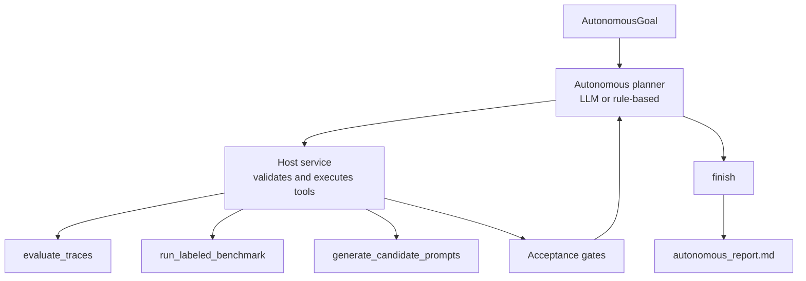

# Autonomous Evaluation Agent Architecture

Project 6 is a bounded autonomous agent system for adaptive evaluation.

## Workflow Versus Agent

Project 3 is a workflow. It runs fixed evaluation steps and stops with proposed
artifacts.

Project 6 is an agent loop. The planner observes state, chooses the next tool,
receives the result, and continues until the host acceptance gates pass or the
iteration bound is reached.

## Tool Boundary

The autonomous planner can select only these tools:

- `evaluate_traces`
- `run_labeled_benchmark`
- `generate_candidate_prompts`
- `finish`

The host executes the tools. This preserves deterministic control over file
writes, benchmark thresholds, and completion status.

## Non-Production Autonomy

The agent can autonomously create review artifacts, including candidate prompt
files. It cannot apply those candidates to production prompts.

This is deliberate: autonomous iteration is useful for evaluation repair, but
production behavior changes still require review, tests, and a merge process.
